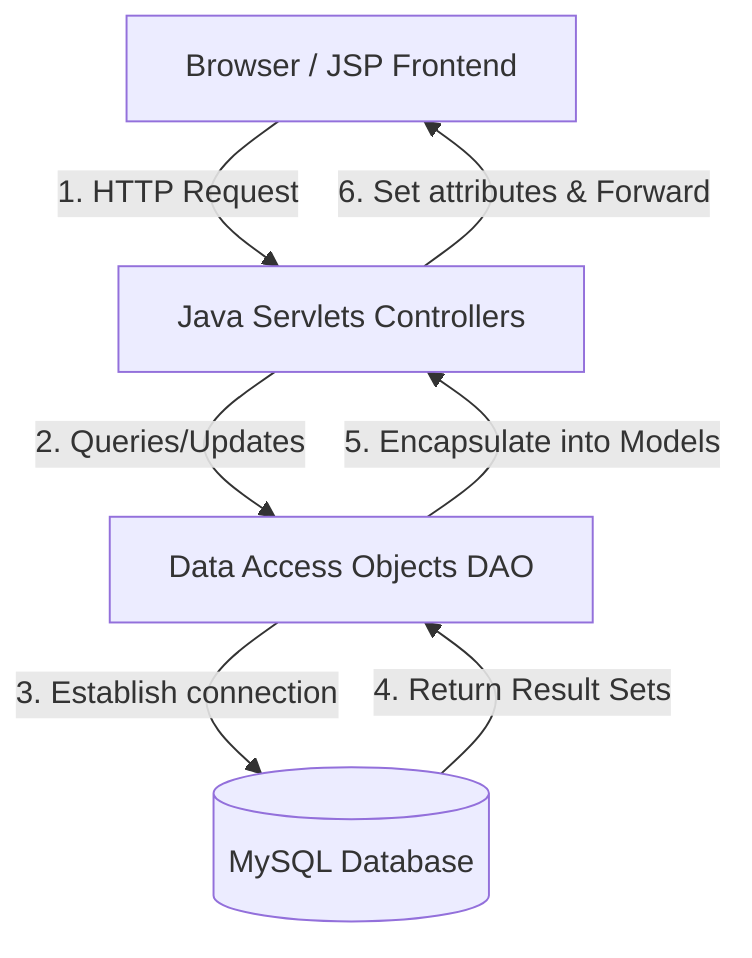

# 🍔 FoodExpress — JEE Food Delivery Application

A clean, modern, and robust **Java Enterprise Edition (JEE)** web application modeled on modern food delivery platforms like UberEats or DoorDash. Built using the **MVC (Model-View-Controller)** pattern with Servlets, JSPs, JDBC, and a MySQL database.

---

## 🚀 Technologies Used


---

## 🎨 System Architecture

This application strictly implements the **Model-View-Controller (MVC)** architectural pattern:



*   **View (Frontend):** JSPs (`index.jsp`, `menu.jsp`, `cart.jsp`, etc.) styled with custom CSS and enhanced with Client-side JS validation.
*   **Controller (Routing & Logic):** Java Servlets (`LoginServlet`, `CartServlet`, `PlaceOrderServlet`, etc.) that handle HTTP requests.
*   **Model (Data Structures):** Java Beans (`User`, `Restaurant`, `Menu`, `OrderTable`, `OrderItem`) mapped to database tables.
*   **Database Operations:** Interface-driven DAO pattern (`UserDAO`/`UserDAOImpl`, etc.) with JDBC.

---

## ✨ Features

*   🔒 **Secure Authentication**: User sign-up & log-in with passwords securely encrypted using **BCrypt** hashing.
*   🏪 **Restaurant Browsing**: Dynamic list of active restaurants sorted with names, cuisine types, average delivery times, addresses, and ratings.
*   🍽️ **Menu Browsing**: Access menu items specific to each restaurant, detailing item descriptions, prices, availability, and food images.
*   🛒 **Interactive Shopping Cart**: Add items, dynamically update item quantities, recalculate totals, or remove items from the cart.
*   💳 **Seamless Checkout**: Provide a delivery address, choose a payment method, review details, and place orders.
*   📜 **Order History**: View all past orders, dates, payments, status, and total transaction values.
*   👤 **Profile Management**: View and modify your profile details (e.g. delivery address and email).

---

## 📂 Project Structure

```text
JEE/
├── src/
│   └── main/
│       ├── java/
│       │   └── com/food/
│       │       ├── Model/          # Java Beans (User, Menu, Restaurant, etc.)
│       │       ├── DAO/            # Data Access Object Interfaces
│       │       ├── DAOImpl/        # JDBC Implementation of DAOs
│       │       ├── servlets/       # Web Controllers handling requests
│       │       └── utility/        # DB Connections & Testing Launcher
│       └── webapp/
│           ├── WEB-INF/            # Configuration & Libraries (web.xml, lib/*.jar)
│           ├── assets/             # Assets and media
│           ├── images/             # Restaurant and dish UI images
│           ├── style.css           # Global layout stylesheet
│           └── *.jsp               # Web Application Pages (index.jsp, cart.jsp, etc.)
```

---

## 🛠️ Database Setup

Create a database named `food_delivery_application` in MySQL and execute the following SQL script to set up all tables and seed sample data:

```sql
-- 1. Create Database
CREATE DATABASE IF NOT EXISTS food_delivery_application;
USE food_delivery_application;

-- 2. Create User Table
CREATE TABLE IF NOT EXISTS user (
    userId INT AUTO_INCREMENT PRIMARY KEY,
    username VARCHAR(100) NOT NULL,
    password VARCHAR(255) NOT NULL,
    email VARCHAR(100) UNIQUE NOT NULL,
    address VARCHAR(255),
    role VARCHAR(50) DEFAULT 'user',
    createdDate TIMESTAMP DEFAULT CURRENT_TIMESTAMP,
    lastLoginDate TIMESTAMP DEFAULT CURRENT_TIMESTAMP ON UPDATE CURRENT_TIMESTAMP
);

-- 3. Create Restaurant Table
CREATE TABLE IF NOT EXISTS restaurant (
    restaurantId INT AUTO_INCREMENT PRIMARY KEY,
    restaurantName VARCHAR(150) NOT NULL,
    cuisineType VARCHAR(100),
    deliveryTime INT,
    address VARCHAR(255),
    rating DOUBLE,
    isActive BOOLEAN DEFAULT TRUE,
    imagePath VARCHAR(255)
);

-- 4. Create Menu Table
CREATE TABLE IF NOT EXISTS menu (
    menuId INT AUTO_INCREMENT PRIMARY KEY,
    restaurantId INT,
    itemName VARCHAR(150) NOT NULL,
    description TEXT,
    price DOUBLE NOT NULL,
    isAvailable BOOLEAN DEFAULT TRUE,
    imagePath VARCHAR(255),
    FOREIGN KEY (restaurantId) REFERENCES restaurant(restaurantId) ON DELETE CASCADE
);

-- 5. Create Order Table
CREATE TABLE IF NOT EXISTS order_table (
    orderId INT AUTO_INCREMENT PRIMARY KEY,
    userId INT,
    orderDate TIMESTAMP DEFAULT CURRENT_TIMESTAMP,
    totalAmount DOUBLE NOT NULL,
    status VARCHAR(50) DEFAULT 'Pending',
    paymentMethod VARCHAR(50),
    restaurantId INT,
    FOREIGN KEY (userId) REFERENCES user(userId) ON DELETE CASCADE,
    FOREIGN KEY (restaurantId) REFERENCES restaurant(restaurantId) ON DELETE CASCADE
);

-- 6. Create Order Item Table
CREATE TABLE IF NOT EXISTS orderitem (
    orderItemId INT AUTO_INCREMENT PRIMARY KEY,
    orderId INT,
    quantity INT NOT NULL,
    itemTotal DOUBLE NOT NULL,
    menuId INT,
    FOREIGN KEY (orderId) REFERENCES order_table(orderId) ON DELETE CASCADE,
    FOREIGN KEY (menuId) REFERENCES menu(menuId) ON DELETE CASCADE
);

-- 7. Seed Sample Restaurants
INSERT INTO restaurant (restaurantName, cuisineType, deliveryTime, address, rating, isActive, imagePath) VALUES 
('The Gourmet Burger', 'American', 25, '123 Main St, Foodville', 4.7, TRUE, 'images/burger.jpg'),
('Sushi World', 'Japanese', 35, '456 Sakurabashi Rd, Foodville', 4.8, TRUE, 'images/sushi.jpg'),
('Pizza Bella', 'Italian', 20, '789 Napoli Way, Foodville', 4.5, TRUE, 'images/pizza.jpg');

-- 8. Seed Sample Menus (IDs 1, 2, 3 correspond to the inserted restaurants above)
INSERT INTO menu (restaurantId, itemName, description, price, isAvailable, imagePath) VALUES
(1, 'Classic Cheeseburger', 'Juicy beef patty, cheddar, lettuce, tomato, special sauce', 12.99, TRUE, 'images/cheeseburger.jpg'),
(1, 'Truffle Fries', 'Crispy golden fries tossed in aromatic white truffle oil and parmesan', 5.99, TRUE, 'images/fries.jpg'),
(2, 'Salmon Nigiri Set', '6 pieces of fresh premium salmon sushi', 18.50, TRUE, 'images/nigiri.jpg'),
(2, 'Spicy Tuna Roll', 'Tuna, spicy mayo, cucumber, sesame', 9.99, TRUE, 'images/tunaroll.jpg'),
(3, 'Margherita Pizza', 'San Marzano tomatoes, fresh mozzarella, fresh basil, extra virgin olive oil', 14.99, TRUE, 'images/margherita.jpg');
```

---

## ⚡ Setup & Installation

### 1. Prerequisites
Ensure you have the following installed on your local machine:
*   **Java Development Kit (JDK 17 or higher)**
*   **MySQL Server (v8.0+)**
*   **Apache Tomcat Server (v10.0+ for Jakarta EE compatibility)**
*   **Eclipse IDE / IntelliJ IDEA / VS Code (with Java Extension Pack)**

### 2. DB Credentials Configuration
Open [DBConnection.java](file:///c:/Users/Loku/Tap-Software/Tap-Workspace/JEE/src/main/java/com/food/utility/DBConnection.java) and verify your MySQL connection string, username, and password:
```java
private static final String URL = "jdbc:mysql://localhost:3306/food_delivery_application";
private static final String USERNAME = "root";  // Change to your MySQL username
private static final String PASSWORD = "root";  // Change to your MySQL password
```

### 3. Running the Project
1. Clone or import this project directory into your IDE as a **Dynamic Web Project** or **Maven/Eclipse Project**.
2. Run your MySQL database and verify the tables are successfully created/seeded using the DB Setup script above.
3. Add the project to your Apache Tomcat target runtime in the IDE.
4. Start the Apache Tomcat server.
5. Open your web browser and navigate to:
   ```text
   http://localhost:8080/JEE/
   ```
   *(Note: The context path may vary depending on your Tomcat configuration, e.g. `http://localhost:8080/JEE/` or `http://localhost:8080/FoodApp/`)*
